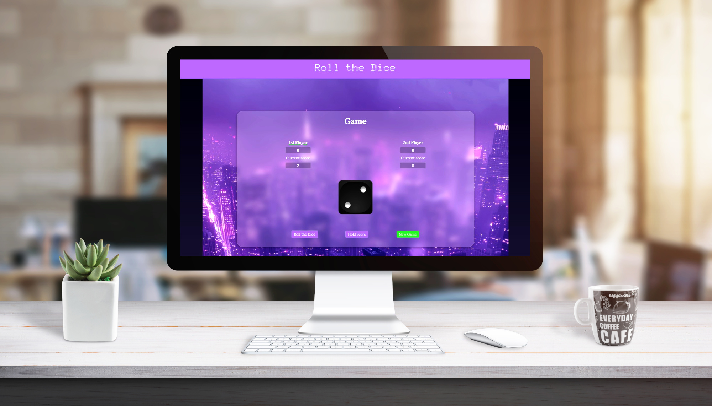

# 🎲 Dice Game – Roll the Dice

Interaktivní **kostková hra pro dva hráče**, postavená v **HTML, CSS a JavaScriptu**. Stylizovaná s použitím barevných proměnných, podporuje dark režim a zahrnuje přehledné herní rozhraní s animací házení kostky.

---

## 🎯 Funkce

- Kostková hra pro 2 hráče s přepínáním aktivního hráče  
- Házení kostkou a ukládání skóre pomocí tlačítek  
- Herní logika naprogramovaná ve vanilla JavaScriptu  
- Efektní zobrazení kostky s odpovídajícím obrázkem (`img/1.png` až `img/6.png`)  
- Dark režim přes třídu `body.dark`  
- Stylová skleněná plocha (`glassmorphism`) pomocí `backdrop-filter`  
- Zvýraznění aktivního hráče a vítěze  

---

## 🛠️ Technologie

- HTML5  
- CSS3 (proměnné, přechody, dark mode)  
- Vanilla JavaScript (bez knihoven)  
- Google Fonts (`Lora`, `Doto`, `Montserrat`)  

---

## 🧪 Co jsem si vyzkoušela

- Implementaci logiky kostkové hry ve vanilla JS  
- Práci s DOM (získání prvků, manipulace tříd a textů)  
- Použití CSS proměnných pro světlo/tmavý motiv  
- Práci s obrázky podle generovaných hodnot  
- Tvorbu uživatelsky přívětivého UI s akcentem na čitelnost a barvy  

---

